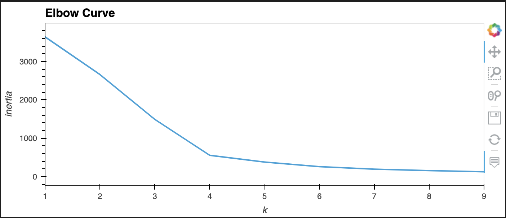
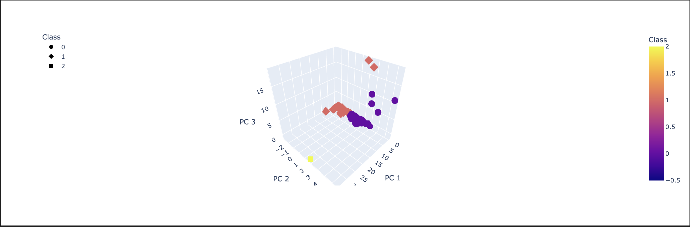
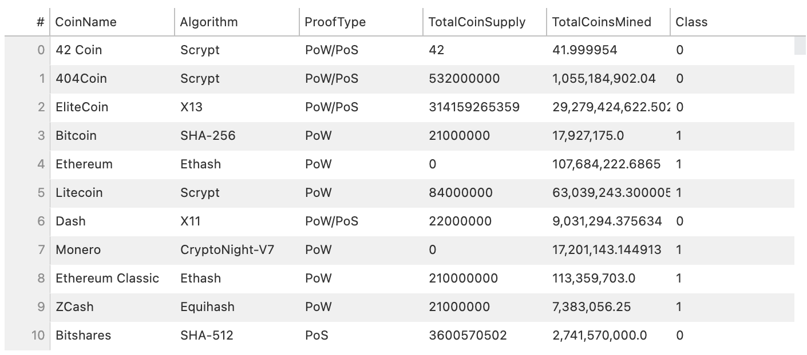
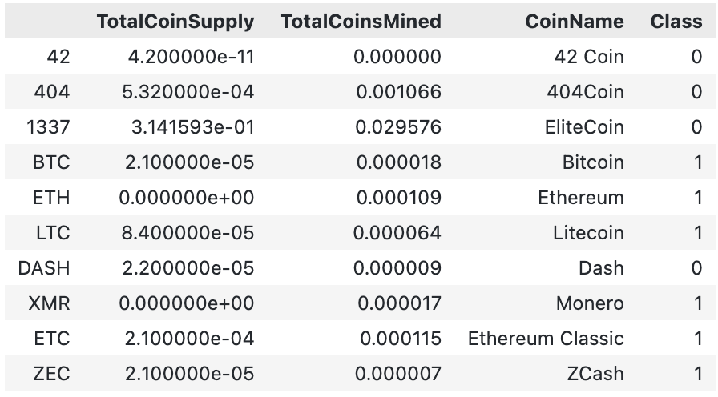
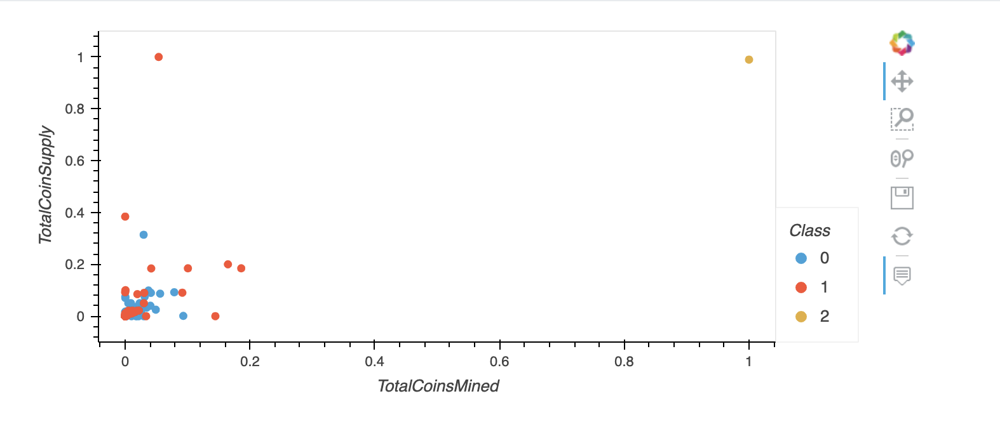

# Cryptocurrencies

We preprocess the data for PCA, reduce the dimensionality of PCA, cluster with k-means, and visualize the results to determine whether a cryptocurrency is tradable. 
___

## Results: 

### Elbow Curve
- 

### 3D-Scatter
-

### Table for Tradable Cryptocurrencies
- 

### Scaled Data 
-

### 
-

____

## Summary: 